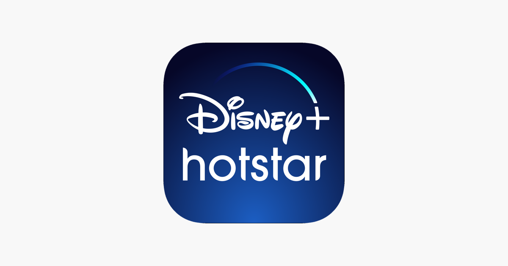

**DATA ANALYSIS REPORT ON:**

# Disney+ Hotstar

**Data Analysis Report**

-   **Company Overview:**

Disney+ Hotstar (also known as Hotstar) is an Indian brand of subscription video on-demand over-the-top streaming service owned by Novi Digital Entertainment of Disney Star and operated by Disney Media and Entertainment Distribution, both divisions of The Walt Disney Company. The brand was first introduced as Hotstar for a streaming service carrying content from Disney Star's local networks, including films, television series, live sports, and original programming, as well as featuring content licensed from third-parties such as HBO and Showtime among others. Amid the significant growth of mobile broadband in India, Hotstar quickly became the dominant streaming service in the country with a significant 50M+ subscriber.

-   **Company Dissection:**

Disney+ Hotstar operates on a freemium as well as subscription model. It is dissected into following ways:

1.  **Content Categories**: Movies, TV Shows, Live Sports, Kids Content, International Content.
2.  **Revenue Model:**

-   Subscription (Premium plans)
-   Advertisement-based revenue (Free users)
-   Sports broadcasting rights

1.  **Technology Backbone** (High-Level)

-   Cloud infrastructure
-   Content Delivery Networks (CDNs)
-   Adaptive bitrate streaming
-   AI-based recommendation engine
-   Real-time sports streaming infrastructure
-   **Real-World Problems Solved by them:**

The Real-world problems solved by Disney+ Hotstar are listed below:

1.  **Affordable Entertainment Access:**

Problem: Traditional cable TV was costly and location-restricted.

Solution:

-   Mobile-first streaming
-   Low-cost subscription plans
-   Regional language support

1.  **Live Sports Accessibility**

Problem: Sports broadcasts were limited to TV.

Solution:

-   Live IPL streaming
-   Multi-device access
-   Real-time highlights

1.  **Regional Content Availability**

Problem: Regional audiences lacked digital access.

Solution:

-   Tamil, Telugu, Malayalam, Kannada, Hindi content
-   Localization strategy
-   **Top Features of Disney+ Hotstar**

1.  **Multi-Language Support:** Hindi, Tamil, Telugu, Malayalam, Kannada, English
2.  **Adaptive Streaming:** Automatically adjusts video quality based on internet speed.
3.  **Live Sports with Low Latency:** IPL, Cricket tournaments, Real-time updates
4.  **Download & Offline Viewing:** Users can download content.
5.  **Parental Controls:** Age-rating based content filtering.
6.  **Cross-Platform Availability:** Mobile, Laptop, Smart TV, Tablet

-   **Case Study: Content Strategy Analysis of Hotstar OTT Platform**

**Problem Statement:**

In the rapidly evolving Indian OTT market, platforms must continuously optimize their content strategy to remain competitive. With increasing competition and shifting audience preferences toward diverse genres and binge-worthy series, it becomes essential to evaluate whether Hotstar’s content distribution aligns with current market demands.

This study aims to analyse Hotstar’s content catalog to identify:

-   The balance between movies and TV shows
-   Age-group targeting patterns
-   Genre concentration and diversity
-   Year-wise growth trends

The objective is to determine whether the platform’s current content composition supports long-term user engagement and competitiveness or reveals strategic imbalances that may impact its market position.

-   **Dataset Overview**

This dataset contains metadata of TV Shows and Movies available on Disney+ Hotstar. It includes details such as title, genre, release year, language, content type, and other descriptive attributes.

1.  Dataset Name: Disney+ Hotstar Tv and Movie shows
2.  Published year: 2023
3.  File Name: hotstar.csv
4.  Data source: Kaggle
5.  Dataset link: [link](https://www.kaggle.com/datasets/goelyash/disney-hotstar-tv-and-movie-catalog)
6.  Dataset size: 1.4 MB

-   **Dataset Structure**

The dataset contains metadata-level information (not streaming content). Each row represents one movie or TV show.

Typical dataset size:

-   Rows: 1000+ entries
-   Columns: 10 attributes
-   **Attribute Description**

Below is a detailed explanation of common attributes in the dataset:

| **S. No** | **Attribute Name** | **Type** | **Meaning** |
| --- | --- | --- | --- |
|  | **hotstar\_id** | Numeric | ID of tv show and movie |
|  | **title** | Text | Title/Name of tv show and movie. |
|  | **description** | Text | Short synopsis or storyline of the movie or TV show. |
|  | **genre** | Categorical | Category of the content based on theme such as Action, Drama, Thriller, Comedy, Romance, Animation |
|  | **year** | Numeric | Year in which the movie or TV show was originally released.   Example: 2018, 2020, 2005 |
|  | **age\_rating** | Categorical | Indicates content suitability for different age groups. Such as U, U/A 7+ / 10+ / 13+ / 18+, A, PG. |
|  | **running\_time** | Numeric | Length of the content. Duration in minutes (e.g., 120 min) |
|  | **seasons** | Numeric | Number of seasons of tv show. |
|  | **episodes** | Numeric | Number of episodes of tv show. |
|  | **types** | Categorical | Content is Tv show or Movie. |

-   **Data Wrangling Implementation on Dataset**

The complete data preprocessing, cleaning, duplicate handling, feature engineering, and transformation steps were implemented using Python (Pandas, NumPy) in Jupyter Notebook. The full implementation is attached as a supplementary document.\[here\]

-   **Key Findings & Interpretation**

Below is a detailed explanation of Key findings of the dataset:

-   1.  **Content Type Distribution**

****

1.  **Interpretation:**

-   Movies form nearly **66% of total content**.
-   TV shows represent about **34%**.

1.  **Business Insight:**

Hotstar is movie-dominant but still maintains a strong TV presence.

1.  **Strategic Risk:**

OTT competitors like Netflix focus heavily on long-form series to increase user retention.  
Movie-heavy catalog may reduce binge-driven engagement.

-   1.  **Age-Based Content Distribution**

****

-   **U (Universal):** Suitable for all age groups; family-friendly with no restricted content
-   **U/A 7+:** Suitable for ages 7 and above.
-   **U/A 13+:** Suitable for ages 13 and above; may include mild violence, mild language, and emotional themes.
-   **U/A 16+:** Suitable for ages 16 and above.
-   **PG (Parental Guidance):** Children can view but parental guidance is advised, similar to U/A.
-   **A (Adults Only):** Strictly for ages 18 and above; contains strong violence, mature themes, and explicit language.

1.  **Interpretation:**

-   Majority content falls under U/A 13+ category.
-   Platform heavily targets teen & young adult audience.
-   Very limited strictly adult (A-rated) content.

1.  **Business Insight:** Hotstar positions itself as:

-   Family-friendly
-   Youth-focused
-   Mass Indian audience platform

1.  **Problem:**

Competitors are investing in bold adult web series, attracting urban premium users.

1.  **Genre-Based Content Distribution**

****

1.  **Interpretation:**

-   Drama dominates the platform.
-   Content heavily skewed toward emotional and narrative-driven formats.
-   Low presence of documentary and sports genres.

1.  **Business Insight:**

Hotstar aligns strongly with Indian audience preference for drama.

1.  **Strategic Risk:** Over-dependence on Drama may:

-   Reduce genre diversity
-   Limit audience expansion
-   Increase content saturation
    1.  **Yearly Content Growth Trend**

****

1.  **Interpretation:**

-   Content volume begins accelerating.
-   Platform catalog during this period was limited (1928–2005).
-   TV shows show aggressive growth post-2016.
-   Reflects OTT boom and pandemic-driven streaming surge.
-   Peak around 2020–2022

1.  **Business Insight:**
    -   **Movie-Dominant Strategy:** Movies consistently outnumber TV shows. Growth strategy focused on catalog expansion rather than original TV dominance.
    -   **Reactive TV Show Growth:** TV content surged mainly after 2016.
2.  **Strategic Risk:** Recent OTT trend favours:

-   High-quality original series
-   Exclusive content
-   Franchise-based storytelling

-   **Core Strategic Problems Identified**

Based on Hotstar movie and TV shows data analysis, we find following major strategic problems which they are facing:

1.  **Problem 1: Over-Dependence on Drama:**

They are heavily concentration in one genre, due to which it may:

-   -   Limit audience diversification
    -   Reduce global appeal

1.  **Problem 2: Movie-Dominant Catalog:**

Movies are:

-   -   Shorter engagement cycles
    -   Lower retention compared to series

Whereas TV shows are:

-   -   Drive binge behavior
    -   Improve subscription stickiness

OTT success today depends on:

-   Long-form series
-   Multi-season engagement

1.  **Problem 3: Limited Adult Premium Content:**

Age rating analysis shows majority youth-friendly content, which are Limited bold, urban-focused series. Comparatively, other competitors target urban millennials more aggressively.

-   **Strategic Recommendations**

Following are some strategic recommendations to solve problem which are identified above:

1.  **Increase High-Quality TV Originals:** Boost long-term engagement.
2.  **Strengthen Long-Running Series Production:** Encourage multi-season originals.
3.  **Balance Movie-TV Ratio:** Move toward engagement-based strategy.
4.  **Expand Genre Diversity**

Invest in:

-   Thriller
-   Documentary
-   Sci-fi
-   International collaborations

1.  **Improve Metadata Quality**

Better content tagging enhances AI recommendations.

1.  **Balance Age Segmentation**

Add selective premium adult originals to compete with Netflix-like platforms

-   **Conclusion**

Disney+ Hotstar represents the transformation of traditional television into digital streaming in India. It successfully combined regional content dominance, Global Disney branding, Live sports scalability. The platform solved major accessibility and affordability issues in Indian entertainment, making digital streaming mainstream.

This analysis shows that Hotstar’s content library is primarily movie-dominated, with a strong focus on Drama and U/A 13+ age-rated content, targeting the youth and family segment. Content growth significantly increased after 2015, reflecting expansion during the OTT boom. However, the platform shows limited genre diversification and comparatively lower investment in TV shows, which may affect long-term user retention in a competitive OTT market. To remain competitive, Hotstar should focus on strengthening original series production, diversifying genres, and improving strategic content balance.

Source Code Repository: \[GitHub Link\]
